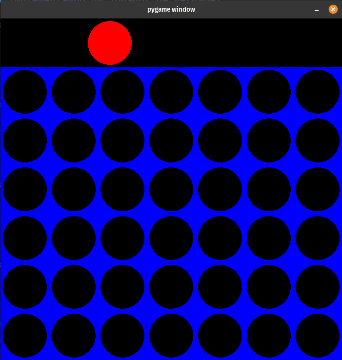
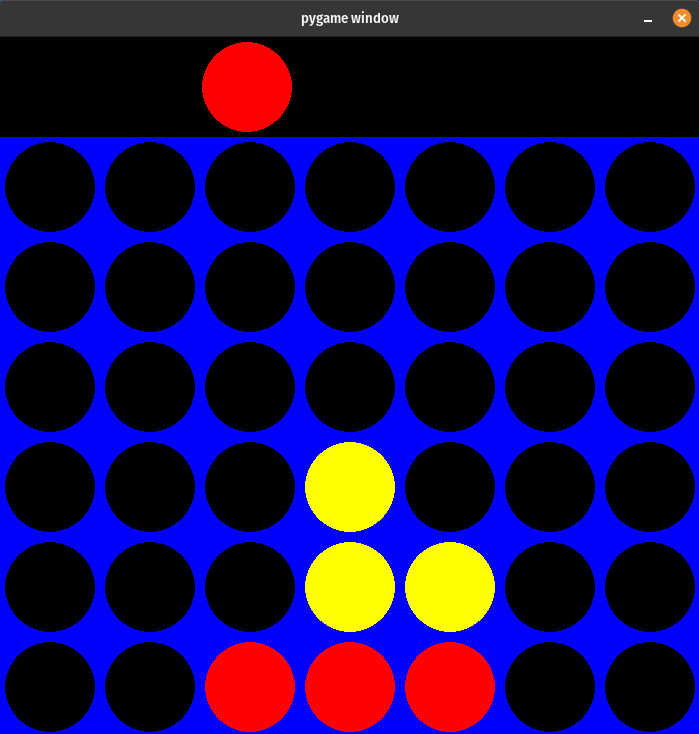
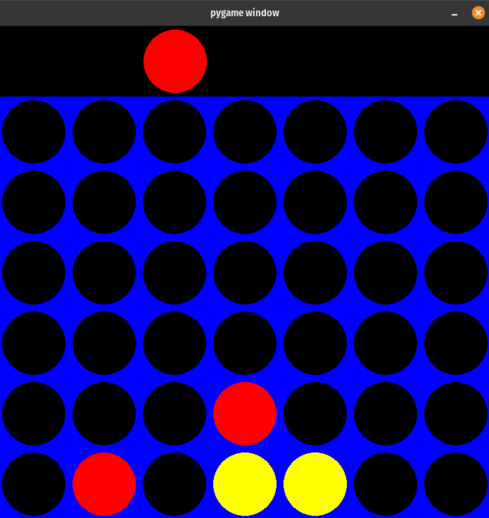
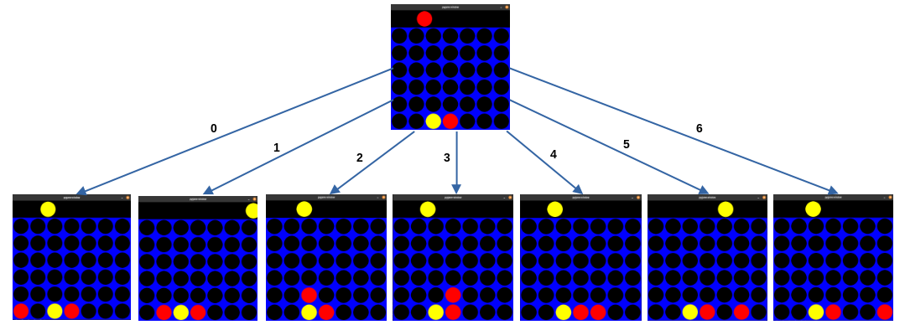
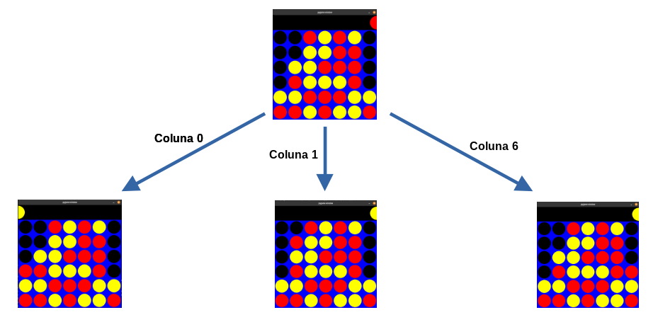
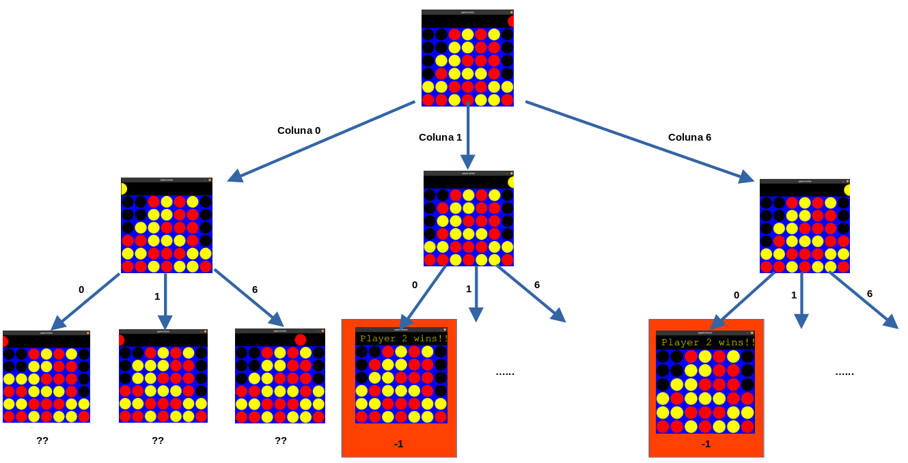
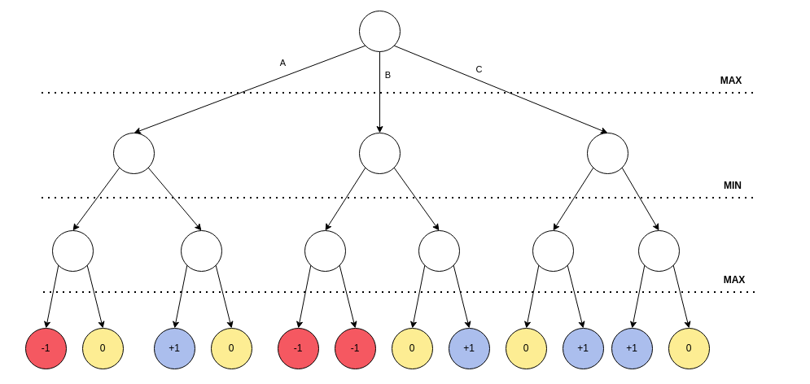
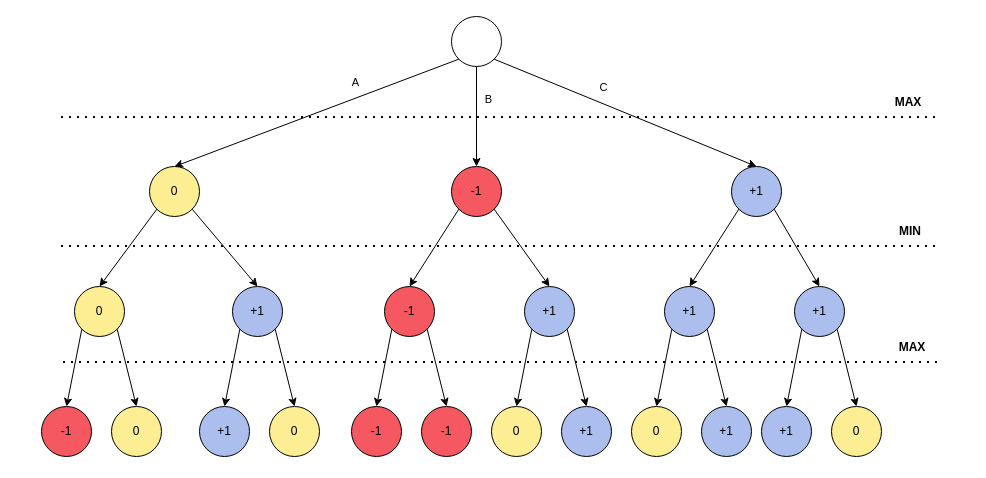
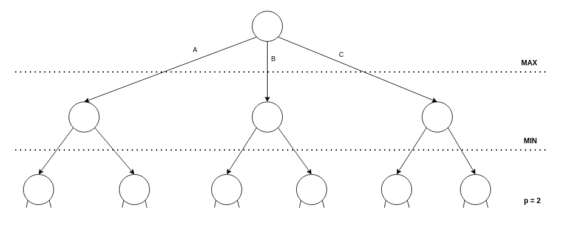

<style>
	footer {
		position: fixed;
		bottom: 10px;
		left: 1050px;
		width: 400px;
	}

	footer img {
		vertical-align: middle;
	}

</style>


Implementando um jogador para Liga4
===

# 

-----

Objetivos da aula
===

**Na aula de hoje você irá**:

- ver um exemplo de jogo de *Connect-4* implementando usando pygame.
- compreender de uma forma introdutória como utilizar o algoritmo [Min-Max](https://en.wikipedia.org/wiki/Minimax) no desenvolvimento de robô capaz de jogar *Connect-4*.

Todo o material utilizado nesta aula está disponível em [https://github.com/fbarth/Connect4-Python](https://github.com/fbarth/Connect4-Python).

-----

Jogando entre humanos
===

**Vamos jogar um pouco?**

```bash
cd src
python connect4.py
```
-----

* Deu para entender como o jogo funciona? 
* Você achou difícil ganhar do seu adversário? 
* Que capacidades uma pessoa precisa ter para jogar este jogo? 

-----

Implementando um jogador
===

Na linha 114 e 115 do arquivo [connect4.py](../src/connect4.py) é possível ver o seguinte trecho de código: 

````python
posx = event.pos[0]
col = int(math.floor(posx/SQUARESIZE))
````

Precisamos trocar este trecho por algo como: 

````python
col = player.move(player_code, board)
````

-----

Sendo que o `player` pode ser uma instância da classe: 

````python
class MeuJogador(Player):

def name(self):
    return "Meu Jogador super simples"

def move(self, player_code, board):
    # TODO lógica para escolher uma coluna
    return col
````
-----

Implementando um robô super simples
===

**Qual é o robô mais simples que podemos implementar?**

-----

Implementando um robô super simples
===

Criando um jogador que joga de forma aleatória! 

````python
from random import randint
from Player import Player

class RandomPlayer(Player):

	def name(self):
		return "Random"

	#
	# retorna a coluna onde a bola será jogada
	#
	def move(self, player_code, board, depth):
		return randint(0, 6)
````

````bash
python connect4_with_ai.py random
````

-----

Vamos implementar algo um pouco mais inteligente?
===

* O que seria uma robô mais "inteligente"?
* Que abordagens podemos utilizar para implementar um robô mais **inteligente**? 

-----

Por onde eu começo?
===



-----

O que eu faço agora?
===



-----

E agora?
===



-----

Qual é a melhor opção?
===



É necessário ter uma função qualquer na implementação que diga qual é a melhor ação. Por exemplo, dizendo qual é o estado que tem **maior utilidade** para o nosso robô.

-----

Definindo algumas verificações
===

* é um movimento vencedor?
* está dominando o centro?
* está criando oportunidades na horizontal?
* está criando oportunidades na vertical?
* está criando oportunidades na diagonal?

````bash
python connect4_with_ai.py flat
````

-----

Humanos versus um robô melhorado
===

* Agora temos um robô melhor que o robô aleatório. No entanto, este ainda é um robô que não consegue vencer na maioria das vezes.

* **O que podemos fazer para [melhorar o desempenho](parte4.md) do robô?**

-----

Implementando um robô mais inteligente
===

Considere o seguinte estado onde quem deve jogar é o jogador vermelho: 


-----

Quais são as posições que o jogador vermelho pode jogar?
===



-----

Qual é a melhor jogada?
===

Para responder esta pergunta o meu robô teria que analisar as próximas jogadas. Ou seja, as jogadas do seu adversário. 

-----

Andando um pouco mais na árvore
===



-----

Andando um pouco, pouco... mais na árvore
===


-----

Com base nas informações que você tem agora...
===

**Qual coluna o robô deve escolher quando estiver no estado abaixo?**


-----

Algoritmo Min-Max
===



-----



**Qual ação o robô deve escolher?**

-----

Como implementar o Min-Max
===

````python
def max_value(estado):
	if estado.eh_final():
		return estado.eval()
	v = -math.inf
	for s in estado.sucessores():
		v = MAX(v, min_value(s))
	return v
````

````python
def min_value(estado):
	if estado.eh_final():
		return estado.eval()
	v = math.inf
	for s in estado.sucessores():
		v = MIN(v, max_value(s))
	return v
````

-----

Agora temos um robô vencedor? Vamos testar?
=== 

````bash
python connect4_with_ai.py complete
````

-----

Algoritmo Min-Max com profundidade $p$
===

E se limitarmos a busca até uma determinada profundidade $p$? Por exemplo, no caso abaixo em $p=2$?



O que está faltando?

-----

Função de utilidade
===

* A ideia é substituir a avaliação de estados terminais pela avaliação de estados intermediários. 

* A função de avaliação deve retornar um valor alto para estados que tem uma utilidade maior para o nosso robô e valores baixos para estados que tem um utilidade menor. 

-----

Versão Min-Max com limite de profundidade
===

````python
def max_value(estado, p):
	if p == 0:
		return estado.eval()
	v = -math.inf
	for s in estado.sucessores():
		v = MAX(v, min_value(s, p-1))
	return v
````

````python
def min_value(estado, p):
	if p == 0:
		return estado.eval()
	v = math.inf
	for s in estado.sucessores():
		v = MIN(v, max_value(s, p-1))
	return v
````

-----

Humano versus Min-Max com limite de profundidade
===

Vamos testar o desempenho de um Min-Max com profundidade 1, 3, 5 e 7?

````bash
python connect4_with_ai.py minmax 1

python connect4_with_ai.py minmax 3

python connect4_with_ai.py minmax 5

python connect4_with_ai.py minmax 7
````

-----

Quais foram as diferenças observadas?
===

* Teve alguma diferença em termos de tempo de processamento?
* Teve alguma diferença em termos de desempenho? 
* Alguma das configurações chega a ter um desempenho similar ao de um humano?

-----

Máquina contra Máquina
===

Será que um jogador com min-max pode perder de um jogador aleatório?

````bash
python connect4_ai_versus_ai.py random 0 minmax 5
```` 

E se usarmos um minmax com profundidade igual a 1?

````bash
python connect4_ai_versus_ai.py random 0 minmax 1
````

-----

E se jogarmos min-max contra min-max?
===

Com profundidades iguais:

````bash
python connect4_ai_versus_ai.py minmax 5 minmax 5
````

Com profundidades diferentes:

````bash
python connect4_ai_versus_ai.py minmax 1 minmax 5
````

-----

Questões gerais
===

* Será que uma pessoa pode aperfeiçoar o seu conhecimento sobre Liga4 jogando contra máquinas?

* Será que uma pessoa pode aperfeiçoar o seu conhecimento sobre Liga4 estudando partidas feitas por duas máquinas?

* Será que é possível uma máquina aprender a jogar Liga4 jogando contra uma outra máquina que sabe Liga4?

-----

Questões gerais
===

* Será que uma pessoa pode aperfeiçoar o seu conhecimento sobre Liga4 jogando contra máquinas? :+1:

* Será que uma pessoa pode aperfeiçoar o seu conhecimento sobre Liga4 estudando partidas feitas por duas máquinas? :muscle: :+1:

* Será que é possível uma máquina aprender a jogar Liga4 jogando contra uma outra máquina que sabe Liga4? :+1: :+1: :+1: 

-----

Um pouco de história e tendências
===

-----

Origens
===

* [Claude Shannon. Programming a Computer for Playing Chess. Philosophical Magazine, Ser.7, Vol. 41, No. 314 - March 1950.](https://vision.unipv.it/IA1/ProgrammingaComputerforPlayingChess.pdf) Uma proposta de uso do algoritmo Min Max no jogo de Xadrez. 

* [Claude Shannon](https://en.wikipedia.org/wiki/Claude_Shannon) cita neste artigo o livro publicado por [John von Neumann](https://en.wikipedia.org/wiki/John_von_Neumann) e [Oskar Morgenstern](https://en.wikipedia.org/wiki/Oskar_Morgenstern): Theory of Games and Economic Behavior publicado em 1944. 

* John von Neumann cita no seu livro as origens da ideia de Min Max: *Waldegrave (1713) Minmax solution of a 2-person, zero-sum game, reported in a letter from P. de Montmort to N. Bernouilli, transl, and with comments by H. W. Kuhin in W. J. Baurnol and Goldfeld (eds.), Precusors of Mathenatical Economics*.

-----

Deep Blue versus Garry Kasparov
===


* O DeepBlue fazia uso do algoritmo MinMax com poda alpha-beta. 
* A solução tinha 256 processadores dedicados para a tarefa.
* Examinava em torno de 30 bilhões de movimentos por minuto. 

-----

* A profundidade geralmente era de 13. No entanto, em determinadas situações podia chegar até 30. 
* Para fazer a poda da árvore ou alongar o caminho de busca, a solução fazia uso de uma base de jogos históricos de Xadrez. Com isto era possível determinar o valor de um estado sem continuar a busca.

* [Game over: Kasparov and The Machine, 2003](https://www.imdb.com/title/tt0379296/)
* [Deep Blue - Down the Rabbit Hole](https://www.youtube.com/watch?v=HwF229U2ba8): um vídeo um tanto quanto interessante sobre o assunto com vários detalhes que são difíceis de encontrar em outras fontes.

-----

O que mudou de Shannon até o Deep Blue?
===


-----

O avanço no jogo de xadrez parou depois do Deep Blue?
===

   

-----

AlphaZero
===

 

----- 

Impactos
===

* M. Sadler, N. Regan, e G. Kasparov, Game Changer: AlphaZero’s Groundbreaking Chess Strategies and the Promise of AI. New in Chess, 2019.

* N. Tomasev, U. Paquet, D. Hassabis, e V. Kramnik, “Assessing Game Balance with AlphaZero: Exploring Alternative Rule Sets in Chess”, CoRR, vol. abs/2009.04374, 2020, [Online]. Disponível em: https://arxiv.org/abs/2009.04374

-----

Próximas atividades e referências
===

* Códigos, textos, roteiro de exercícios e referências podem ser obtidas no link [http://fbarth.net.br/Connect4-Python/](http://fbarth.net.br/Connect4-Python/)

* Sugiro fazer o fork ou clone do projeto [https://github.com/fbarth/Connect4-Python](https://github.com/fbarth/Connect4-Python) e seguir as orientações que estão em [http://fbarth.net.br/Connect4-Python/configuracao/](http://fbarth.net.br/Connect4-Python/configuracao/).
